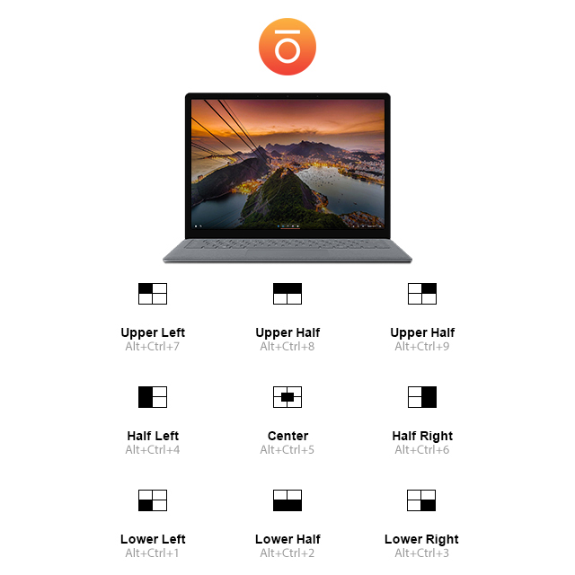

<p align="center">
  <br><br>
</p>

# Sōkan (壮観)

Easily organize windows without using a mouse.

---

#### Table of Contents:
* [Download](#download)
* [How to setup](#how-to-setup)
* [Development](#development)
* [Question](#question)

---

## Download

You can download the application on the release page.<br />
https://github.com/genesisneo/window-control/releases

---

## How to setup:

* This application only works on **_Windows_** operating system
* Download, Fork, or Clone this repo
* Download and install [node.js ^16.10.0](https://nodejs.org/en/download/releases/). If you need multiple version you can use [nvm-windows](https://github.com/coreybutler/nvm-windows)
* Open your preferred **_shell_**. If your using **_PowerShell_** as Administrator, you need to execute this command
```
Set-ExecutionPolicy RemoteSigned
```
* Install `node-gyp` globally
```
npm i node-gyp -g
```
* Install `windows-build-tools` globally
```
npm i -g --production windows-build-tools --vs2015
```
* Once done, you need to configure your **_Python 2.7_**
```
npm config set python python2.7
```
* Configure `msvs 2015`
```
npm config set msvs_version 2015
```
* Set Python executable path, where `{user}` is your **_Windows_** user name
```
npm config set python C:\Users\{user}\.windows-build-tools\python27\python.exe
```
* Open **_Environment Variables_** and under **_User variables for Windows_** add `PYTHON` with the value of `%USERPROFILE%\.windows-build-tools\python27\python.exe`
* Under **_System variables_** add `PY_HOME` with value of `%USERPROFILE%\.windows-build-tools\python27\`
* On **_System variables_**, look for `Path` and add this values through "Edit text..." `%PY_HOME%;%PY_HOME%\Lib;%PY_HOME%\DLLs;%PY_HOME%\Lib\lib-tk;`
* Apply all changes, close **_Environment Variables_** and restart your prefered **_shell_**
* On your prefered **_shell_**, navigate to this repo and install all the dependencies
```
npm i
```
* You can now do the following:
```
# start application
npn run start

# package the application
npm run package

# build the application
npm run build
```

---

## Development

To show developer tool and excute console log. You can add the following code after `window.loadFile`.

```
window.webContents.openDevTools();
window.webContents.executeJavaScript(`console.log(">>> ${process.execPath}")`);
```

---

## Question:

If you have question, you can always contact me on Twitter [@genesis_neo](https://twitter.com/genesis_neo) and of course here in GitHub [@genesisneo](https://github.com/genesisneo). Thank you.

---

<p align="center">-=[ :heart: ]=-</p>